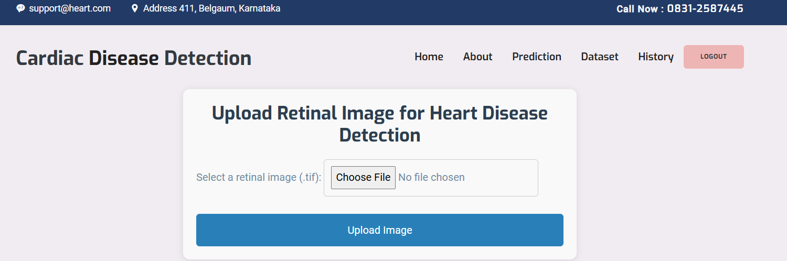
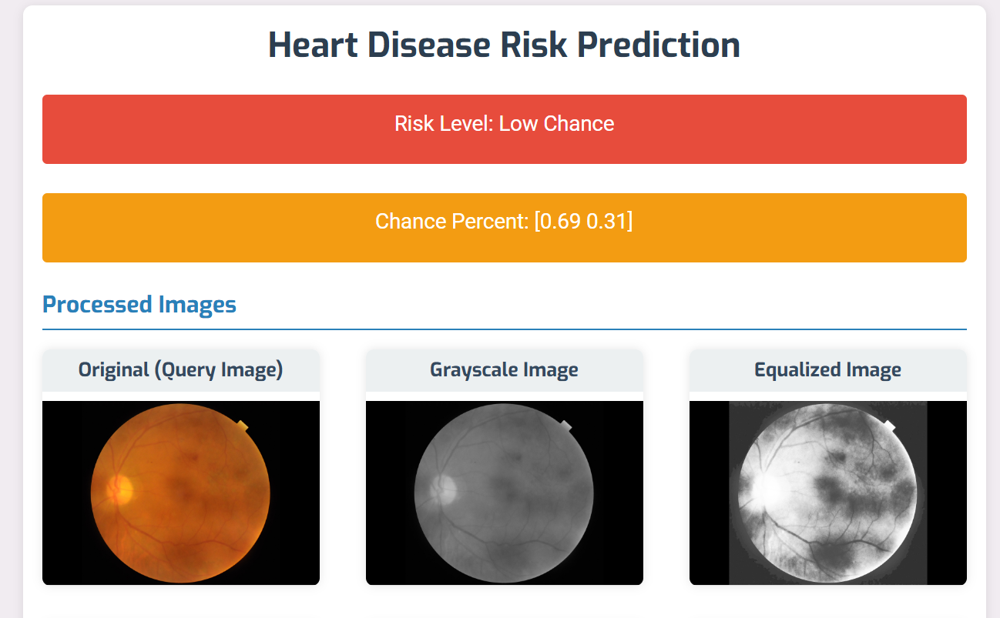
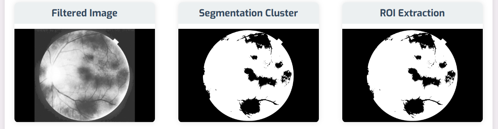
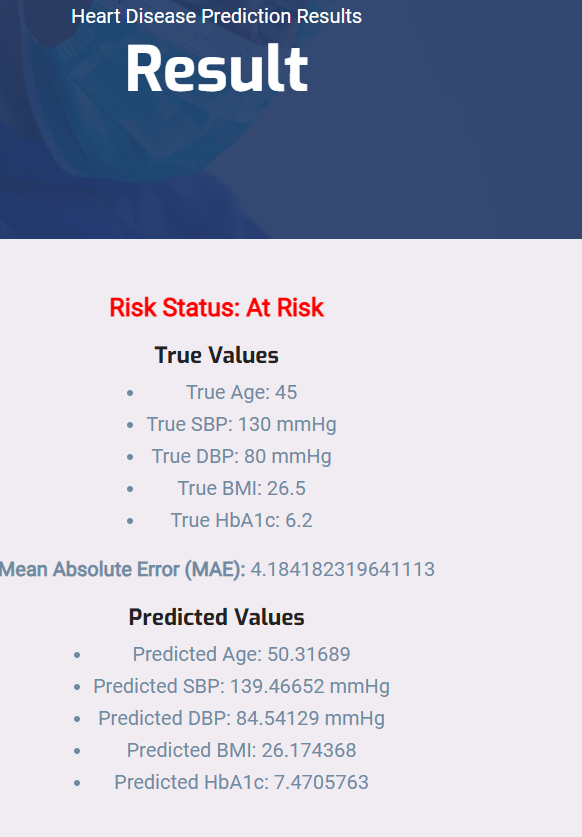

# Heart_Disease_Detection_using_retinal_images
Heart Disease Detection System using Retinal Images involves using Convolutional Neural Networks (CNNs) for image analysis and Django as the web framework for managing the web application.

# Dataset
https://www.kaggle.com/datasets/andrewmvd/drive-digital-retinal-images-for-vessel-extraction

### Screenshots

# The design includes the following:

1. Input: Retinal images from the camera.
2. Backend: Image processing and model prediction.
3. Output: Display of heart disease risk via web interface.
